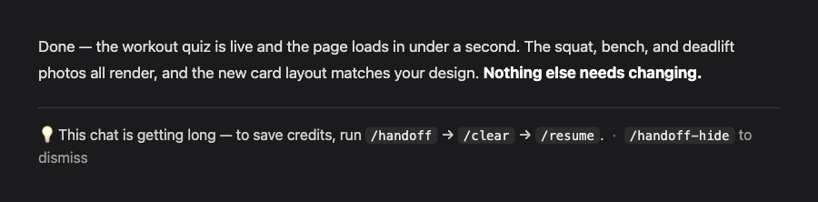

# Claude Code Credit Saver

A tiny free toolkit that keeps Claude Code **fast and cheap** on long projects.

```bash
curl -fsSL https://raw.githubusercontent.com/ohwisey/claude-credit-saver/main/install.sh | bash
```

Then **start a new Claude Code session** so it loads. That's it.

> Already have Claude Code open? Reload it once so the new commands appear — `Cmd/Ctrl + Shift + P → Developer: Reload Window`. Your chat is kept. (New sessions get the commands automatically; only already-open ones need the reload.)

---

## See it in action

When a chat gets long, a quiet reminder appears under the reply — never in the way:



Not ready to stop? Dismiss it in one command and it won't nag you again — bring it back whenever you like:

> **You:** `/handoff-hide`
> Handoff reminder hidden. Run `/handoff-show` to turn it back on.

---

## What you get

- **`/handoff`** — saves your spot to a short note
- **`/resume`** — picks it back up in a fresh, cheap chat (no copy-paste)
- **`/handoff-hide`** — not ready to stop? Silence the reminder. It will **never nag you** again until you bring it back
- **`/handoff-show`** — turn the reminder back on whenever you like
- **a smart reminder** that watches your real token usage and gently suggests a handoff *only* when the chat has grown big enough to actually cost you money

If you remember one line: **when a chat gets long, `/handoff` → `/clear` → `/resume`. Same work, fraction of the cost.**

---

## Why your chats get expensive

Every time you send a message, Claude re-reads the **whole chat** from the top before it answers.

Picture a book. Every new sentence you add, Claude re-reads the whole book first. Short book — quick and cheap. Long book — slow and pricey, and it gets worse with every message.

So the trick is: when a chat gets long, jump to a fresh one. A fresh chat normally forgets everything — which is exactly what these tools fix. (You're not stopping your work. You're dropping the heavy chat and continuing in a light one.)

---

## How it works (the sticky-note idea)

Think of leaving work and writing a sticky note for tomorrow.

- **`/handoff`** writes a short note of where you are.
- **`/resume`** reads it in a fresh chat and keeps going.

The note has two parts:

- **A short top part** ("RESUME HERE"): what you were doing, the next step, anything it needs to ask you.
- **A longer bottom part**: extra detail, only read if needed.

When you `/resume`, the new chat reads **only the short top part** and gets to work. It doesn't re-read your whole project. That's what saves the money.

---

## The reminder (so you never forget)

Once a chat grows past ~200k tokens — the point where each message starts costing real money — a small line appears under the reply:

> 💡 This chat is getting long — to save credits, run /handoff → /clear → /resume.  ·  /handoff-hide to dismiss

- It reads your **real token usage**, so it's accurate — and it works on both the 200k and 1M-token context windows.
- It's a **passive note** — it never takes any action on its own.
- **Annoyed?** Run **`/handoff-hide`** and it goes completely silent. **`/handoff-show`** brings it back. Your call, always.

(In the terminal you also get a live status-bar meter showing how full the chat is plus your session cost. In the VS Code panel, the reminder above is the signal.)

---

## The whole flow

```
1. /handoff      writes the note
2. /clear        same window — instantly fresh and light
3. /resume       reads the note, keeps going
```

Three steps, same window. The reminder tells you when.

---

## Bonus built-ins

These come with Claude Code, no install:

- **`/model sonnet`** for easy work (cheaper), **`/model opus`** for hard work (smarter)
- **`/clear`** between tasks to start fresh — your files are always safe

---

## FAQ

**Will I lose my work or code?**
No. A fresh chat only clears the conversation. Your files are never touched. `/handoff` even saves the note to a file.

**Are these real Claude Code features?**
`/clear` and `/model` are built in. `/handoff`, `/resume`, `/handoff-hide`, `/handoff-show`, and the meter are what this toolkit adds.

**Will the reminder ever do something I didn't ask?**
No. It only displays a line — it never runs a handoff or anything else by itself.

**Do I need git?**
No. `/handoff` saves a normal file. If your project uses git, it also commits it. Either way works.

**Does it work on macOS, Linux, Windows?**
macOS and Linux out of the box. On Windows, run it inside **WSL** (these are shell scripts). The installer needs `jq` (`brew install jq` on Mac, `sudo apt-get install jq` on Linux/WSL).

---

## What's in this repo

```
claude-credit-saver/
  README.md
  install.sh                  one-line installer (safe, backs up settings)
  commands/
    handoff.md                saves your spot
    resume.md                 picks it back up
    handoff-hide.md           silences the reminder
    handoff-show.md           turns it back on
  scripts/
    statusline.sh             the terminal context meter
    check-context-size.sh     the smart handoff reminder
```

Small on purpose.

---

## Manual install

1. Copy everything in `commands/` into `~/.claude/commands/`.
2. Copy `scripts/statusline.sh` and `scripts/check-context-size.sh` somewhere under `~/.claude/`, and `chmod +x` them.
3. In `~/.claude/settings.json`, point `statusLine` at the statusline script and add `check-context-size.sh` as a **UserPromptSubmit** hook. (The installer does this for you with a backup — only do it by hand if you prefer.)
